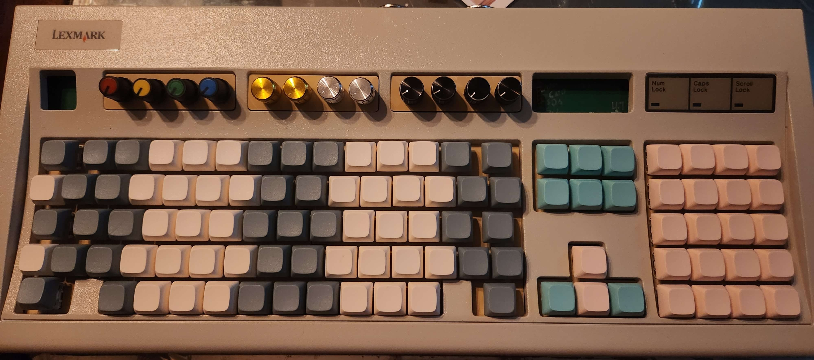

# keyboard-keyboard

A hall-effect MIDI keyboard controller built around the Electrosmith Daisy Seed (STM32H750V). The layout follows the IBM Model M form factor but is tuned to work as a Wicki-Hayden isomorphic musical keyboard. Keys 81–100 are drum pads on MIDI channel 10.



## Hardware

- **MCU:** Electrosmith Daisy Seed Rev4 (STM32H750V)
- **Sensors:** 100x MT9105ET hall-effect sensors across 13 SN74LV4051A analog muxes (AM1–AM13)
- **Pots:** 12 trim potentiometers on AM14–AM15, read as MIDI CC
- **Display:** 128x32 SSD1306 OLED over I2C
- **MIDI:** USART1 at 31250 baud (DIN-5 out, opto-isolated in via 6N138)

The firmware currently drives 100 switches across all 13 muxes. AM10–AM13 require a hardware bodge to function — see [Known Issues](#known-issues).

Full pin mapping and mux architecture: [`keyboard_keyboard/code/HARDWARE.md`](keyboard_keyboard/code/HARDWARE.md)

KiCad schematic: `keyboard_keyboard/kicad/keyboard_keyboard.kicad_sch`

## Firmware

Firmware is in `keyboard_keyboard/code/`, written in Rust using [RTIC](https://rtic.rs/) for the real-time task scheduler.

### Setup

```sh
rustup target add thumbv7em-none-eabihf
rustup component add llvm-tools-preview
cargo install cargo-binutils
# probe-rs / cargo-embed: https://probe.rs/docs/getting-started/installation/
```

### Build and flash

Run these from `keyboard_keyboard/code/`:

```sh
cargo check        # type-check without a connected device
cargo build        # compile for thumbv7em-none-eabihf
cargo embed        # flash to Daisy Seed (reads Embed.toml)
```

RTT logs stream automatically during `cargo embed`. Set `DIAG_LOGGING = true` in `src/main.rs` for verbose per-switch ADC and baseline output.

GDB attach (in a separate terminal after `cargo embed`):

```sh
arm-none-eabi-gdb target/thumbv7em-none-eabihf/debug/app
# in gdb:
target remote :1337
```

### How it works

The `timer_handler` task fires at 1 kHz, scans all 13 muxes × 8 channels, and runs a three-state machine (`Idle → FirstActuated → FullyActuated`) per switch. Velocity is derived from the time between two ADC thresholds within an 80 ms window. Pot values are scanned every 10 ms and sent as CC messages. MIDI events queue into a `heapless::spsc::Queue` and are sent by a lower-priority `process_events` task.

Boot calibration averages 64 ADC samples per switch to establish per-key baselines before the timer starts.

## Known Issues

**U1 (74HC138D) PCB errata:** Pin 5 (`E2~`, active-low enable) is wired to +3.3V instead of GND, permanently disabling the decoder. AM10–AM13 (switches HE71–HE100) will not work until this is fixed.

Fix: solder bridge pin 5 → pin 4 (GND) on the SO16 package. They are adjacent.

**Daisy Seed errata:** Pad 33 (D26) has no ADC function. AM14/AM15 pot reads use A11 (D28, pad 35). Run a bodge wire from pad 33 → pad 35 and leave D26 unconfigured in firmware.

## Acknowledgements

- Hall-effect keyboard layout based on [peppapighs/HE60](https://github.com/peppapighs/HE60/tree/main)
- Model M physical layout based on [dcpedit/mod-mmm](https://github.com/dcpedit/mod-mmm)
